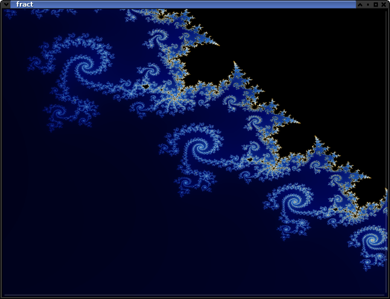

# fract

A fractal generator with various options for
mandelbrot-, julia- and newton-sets.
And a improved rendering with antialiasing.

## Building

### Debian

Use the following commands to get the prerequisits (run with sudo or as root):
<pre>
apt-get install git build-essential meson
apt-get install libgtkmm-3.0-dev
</pre>

The compile goes this way:
<pre>
   meson setup build -Dprefix=/usr
   cd build
   meson compile
   ./fract
</pre>

If you decide to keep it (run with sudo or as root):
<pre>
   cd build
   meson install
</pre>

### Windows

Use msys2 choose and preferred flavor and stick to it (a bit more ist explained with genericImg):
<pre>
pacman -S base-devel
pacman -S ${MINGW_PACKAGE_PREFIX}-gcc
pacman -S ${MINGW_PACKAGE_PREFIX}-meson
pacman -S ${MINGW_PACKAGE_PREFIX}-gtkmm3
</pre>

The compile goes this way:
<pre>
   meson setup build -Dprefix=${MINGW_PREFIX}
   cd build
   meson compile
   ./fract.exe
</pre>

## Usage

- All options are shown in a context menu with the right mouse click
- To zoom just press the left mouse button and drag a rectangle for the next view

