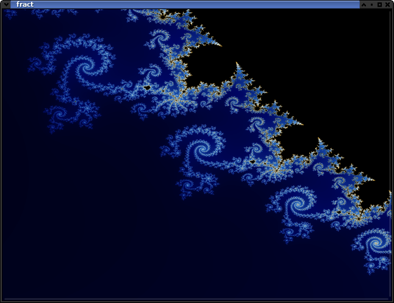

# fract

A fractal generator with various options for
mandelbrot-, julia- and newton-sets.
And a improved rendering with antialiasing.

## Building

### Debian

Use the following commands to get the prerequisits (run with sudo or as root):
<pre>
apt-get install git build-essential meson
apt-get install libgtkmm-3.0-dev
apt-get install libsoup-3.0-dev
</pre>

The compile goes this way:
<pre>
   meson setup build -Dprefix=/usr
   cd build
   meson compile
   ./fract
</pre>

If you decide to keep it (run with sudo or as root):
<pre>
   cd build
   meson install
</pre>

### Windows

Use msys2 choose a preferred flavor and stick to it (a bit more ist explained with genericImg):
<pre>
pacman -S base-devel
pacman -S ${MINGW_PACKAGE_PREFIX}-gcc
pacman -S ${MINGW_PACKAGE_PREFIX}-meson
pacman -S ${MINGW_PACKAGE_PREFIX}-gtkmm3
pacman -S ${MINGW_PACKAGE_PREFIX}-libsoup-3.0
</pre>

The compile goes this way:
<pre>
   meson setup build -Dprefix=${MINGW_PREFIX}
   cd build
   meson compile
   ./fract.exe
</pre>

#### VisualStudio(R)

The following is experimental, but if you have some experience with VS you may get this to work :

Download/build Gtk-3 release from  https://github.com/wingtk/gvsbuild/releases/
Modify the env as suggested on the main page, but add:
<pre>
PKG_CONFIG_PATH = "C:\GTK_INSTALL\lib\pkgconfig"
</pre>

Get a recent Version >= 3.14 of python from python.org
At least for me python was not added to path so modify your path:
"C:\Users\USER\AppData\Local\Programs\Python\Python314\Scripts\"

Open a command-line, install meson:
<pre>
pip install meson
</pre>

The additional dependencies will fail, e.g. libsoup either you may find some place to get a VS-Version, build it or:
As it just allows a simplified download remove the dependency and, comment these function in LifeQueryDialog.

Create a solution:
<pre>
meson setup buildVS -Dbackend=vs2022 -Dprefix=YOUR_PREFEED_PROGRAM_LOCATION
<pre>

## Usage

- All options are shown in a context menu with the right mouse click
- To zoom just press the left mouse button and drag a rectangle for the next view

## Life

Also available a "conways game of life" implementation.
With the option to use .life (1.05,1.06),.cell and .rle formated links 
from the web or paste cell patterns into the program.
